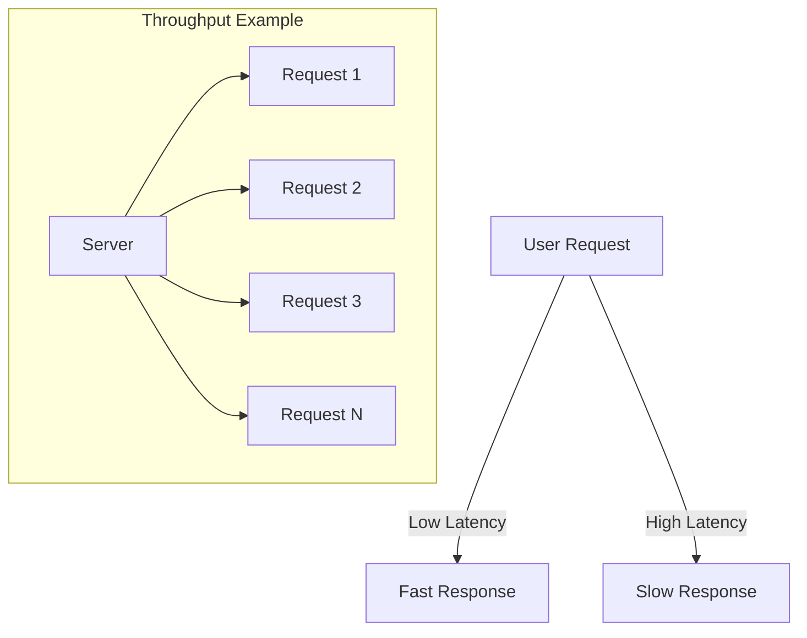

```mermaid
graph TD
    A[User Request] -->|Low Latency| B[Fast Response]
    A -->|High Latency| C[Slow Response]

    subgraph Throughput Example
        D[Server]
        D --> E1[Request 1]
        D --> E2[Request 2]
        D --> E3[Request 3]
        D --> E4[Request N]
    end
```
